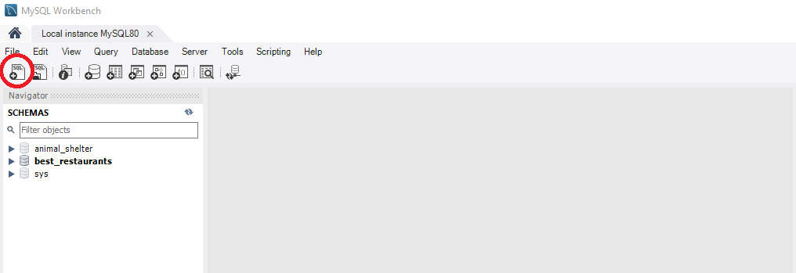

<h1 align="center"><strong>Dr Sneuss' Factory</strong></h1>

<h4 align="center"><em>A Factory portal that allows engineers and machines to be added/removed/updated/related</em></h4>


##### __Created:__ 8/7/2020
##### __Last Updated:__ 8/7/2020 
##### By _**Tyson Lackey**_  


## Description

A SQL database stores Engineer and Machine detials as well as a join table to associate their many to many relationship. The program can allow a user to create, edit, delete, and view Engineer/Machine records. Joins can be added from either the Engineer or Machine view to records in the other, allowing the user to assign/remove machines to engineers and visa versa.

## Setup/Installation Requirements

##### &nbsp;&nbsp;&nbsp;&nbsp;&nbsp;&nbsp; Configue MySQL Workbench Database:
1. Launch MySQL Workbench
2. Select "Create a new SQL tab for executing queries"

3. Enter the following SQL into the query window and click "execute"

```
DROP DATABASE IF EXISTS tyson_lackey;
CREATE DATABASE tyson_lackey;
USE tyson_lackey;

CREATE TABLE `engineers` (
  `EngineerId` int NOT NULL AUTO_INCREMENT,
  `Name` longtext,
  PRIMARY KEY (`EngineerId`)
);

CREATE TABLE `machines` (
  `MachineId` int NOT NULL AUTO_INCREMENT,
  `Name` longtext,
  PRIMARY KEY (`MachineId`)
);

CREATE TABLE `engineermachine` (
  `EngineerMachineId` int NOT NULL AUTO_INCREMENT,
  `EngineerId` int NOT NULL,
  `MachineId` int NOT NULL,
  PRIMARY KEY (`EngineerMachineId`),
  KEY `IX_EngineerMachine_EngineerId` (`EngineerId`),
  KEY `IX_EngineerMachine_MachineId` (`MachineId`),
  CONSTRAINT `FK_EngineerMachine_Engineers_EngineerId` FOREIGN KEY (`EngineerId`) REFERENCES `engineers` (`EngineerId`) ON DELETE CASCADE,
  CONSTRAINT `FK_EngineerMachine_Machines_MachineId` FOREIGN KEY (`MachineId`) REFERENCES `machines` (`MachineId`) ON DELETE CASCADE
)
```

##### &nbsp;&nbsp;&nbsp;&nbsp;&nbsp;&nbsp;Open via Bash/GitBash:

1. Clone this repository onto your computer:
    "git clone https://github.com/Lackeyt/Factory.Solution"
2. Navigate into the "Factory.Solution" directory in Visual Studio Code or preferred text editor:
3. Open the project by typing "code ." while in the previous directory in your terminal.
4. Open your computer's terminal and navigate to the directory bearing the name of the program and containing the top level subdirectories and files.
5. Enter the command "dotnet build" in the terminal and press "Enter".
6. Enter the command "dotnet watch run" in the terminal and press "Enter".

## Known Bugs

* Front end error handling for null values submitted with forms not in place. (currently just assigned default values in the database)

## Support and contact details

* Discord: TysonL#4409
* Email: lackeyt90@gmail.com


## Technologies Used

* Visual Studio Code
* HTML
* CSS
* Bootstrap
* C#
* MVC
* MySQL Workbench
* Entity Framework
* .NET Core

### License

Copyright (c) 2020 **_Tyson Lackey_**

This software is licensed under the MIT license.